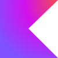
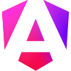
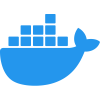
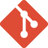
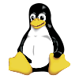
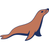
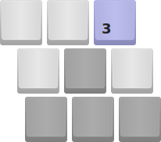
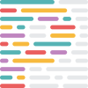

  <!-- Profile Header with Kawaii Animation -->
  

    

    
  

  

<!-- Kawaii Badges -->

  

    
    
    
  

  

    
  

<path d=\"M0 5 Q 25 0, 50 5 T 100 5\" fill=\"none\" stroke=\"%23FFB6C1\" stroke-width=\"2\"/></svg>');
  background-repeat: repeat-x;
  background-size: 50px;
  opacity: 0.5;
">

<!-- Tech Stack with Kawaii Styling -->
<h2 align="center" class="rainbow-text" style="
  margin: 40px 0 25px;
  font-size: 32px;
  font-family: 'Comfortaa', cursive;
">🌸 Tech Stack 🌸</h2>

  

    

      
    

    

      
    

    

      
    

    

      
    

    

      
    

    

      
    

    

      
    

    

      
    

    

      
    

    

      
    

    

      
    

    

      
    

    

      
    

    

      
    

    

      
    

    

      
    

    

      
    

    

      
    

    

      
    

    

      
    

    

      
    

    

      
    

    

      
    

    

      
    

    

      
    

    

      
    

    

      
    

    

      
    

    

      
    

    

      
    

  

  

  

    ✨ Thanks for visiting! ✨
  

<!-- Kawaii Featured Projects -->
<h2 align="center" class="rainbow-text" style="
  margin: 40px 0 25px;
  font-size: 32px;
  font-family: 'Comfortaa', cursive;
">✨ Featured Projects ✨</h2>

  <table style="border-collapse: separate; border-spacing: 25px; margin: 0 auto; transform-style: preserve-3d;">
    <tr>
      <td align="center" width="33%" class="project-card" style="
        padding: 35px 28px;
        border-radius: 25px;
        border: 3px solid #FFB6C1;
        background: linear-gradient(135deg, #FFF0F5 80%, #FFE4E1 100%);
        box-shadow: 0 8px 25px rgba(255,182,193,0.2);
        max-width: 350px;
        transition: all 0.5s cubic-bezier(0.4, 0, 0.2, 1);
        transform-style: preserve-3d;
        backdrop-filter: blur(8px);
        -webkit-backdrop-filter: blur(8px);
      " onmouseover="this.style.transform='translateY(-15px) rotateX(5deg) rotateY(5deg)';this.style.boxShadow='0 20px 40px rgba(255,182,193,0.3)';"
         onmouseout="this.style.transform='';this.style.boxShadow='0 8px 25px rgba(255,182,193,0.2)';">
        <a href="https://github.com/iiXXiXii/Better-Minecraft-Development" style="text-decoration: none;">
          
           
          <b style="font-size: 1.25em; color: #e75480; letter-spacing: 0.5px; transition: color 0.3s;">Better-Minecraft-Development</b>
        </a>
         
        Advanced tools & templates for professional Minecraft mod/plugin development.  
          
          
          
        
      </td>
      <td align="center" width="33%" class="project-card" style="
        padding: 35px 28px;
        border-radius: 25px;
        border: 3px solid #B0E0E6;
        background: linear-gradient(135deg, #F0FFFF 80%, #E0FFFF 100%);
        box-shadow: 0 8px 25px rgba(176,224,230,0.2);
        max-width: 350px;
        transition: all 0.4s cubic-bezier(0.4, 0, 0.2, 1);
      " onmouseover="this.style.transform='translateY(-8px) rotate(-1deg)';this.style.boxShadow='0 12px 30px rgba(176,224,230,0.3)';"
         onmouseout="this.style.transform='';this.style.boxShadow='0 8px 25px rgba(176,224,230,0.2)';">
        <a href="https://github.com/iiXXiXii/XNGIN">
          
           
          <b style="font-size: 1.25em; color: #00b8c8; letter-spacing: 0.5px;">XNGIN</b>
        </a>
         
        Cutting-edge, high-performance game engine built with Kotlin & LWJGL.  
          
          
          
        
      </td>
      <td align="center" width="33%" class="project-card" style="
        padding: 35px 28px;
        border-radius: 25px;
        border: 3px solid #DDA0DD;
        background: linear-gradient(135deg, #FFF0FF 80%, #FFE6FF 100%);
        box-shadow: 0 8px 25px rgba(221,160,221,0.2);
        max-width: 350px;
        transition: all 0.4s cubic-bezier(0.4, 0, 0.2, 1);
      " onmouseover="this.style.transform='translateY(-8px) rotate(1deg)';this.style.boxShadow='0 12px 30px rgba(221,160,221,0.3)';"
         onmouseout="this.style.transform='';this.style.boxShadow='0 8px 25px rgba(221,160,221,0.2)';">
        <a href="https://github.com/iiXXiXii/Minecraft-Development-Bible">
          
           
          <b style="font-size: 1.25em; color: #e6b800; letter-spacing: 0.5px;">Minecraft-Development-Bible</b>
        </a>
         
        The ultimate, community-driven knowledge base for Minecraft development.  
          
          
        
      </td>
    </tr>
  </table>

---

<!-- GitHub Stats with Kawaii Styling -->
<h2 align="center" style="
  margin: 40px 0 25px;
  font-size: 32px;
  color: #FF69B4;
  font-family: 'Comfortaa', cursive;
  text-shadow: 2px 2px 4px rgba(255,182,193,0.3);
">📊 GitHub Stats 📊</h2>

  

    

    

  

<!-- Kawaii Contact Section -->
<h2 align="center" style="
  margin: 40px 0 25px;
  font-size: 32px;
  color: #FF69B4;
  font-family: 'Comfortaa', cursive;
  text-shadow: 2px 2px 4px rgba(255,182,193,0.3);
">🌸 Let's Connect! 🌸</h2>

  

    <a href="https://xcuti.io" style="
      display: inline-flex;
      align-items: center;
      gap: 12px;
      text-decoration: none;
      color: #FF69B4;
      padding: 12px 24px;
      border-radius: 18px;
      background: rgba(255,182,193,0.1);
      border: 2px solid rgba(255,182,193,0.3);
      transition: all 0.4s ease;
    " onmouseover="this.style.transform='translateY(-6px) scale(1.05)';this.style.boxShadow='0 12px 25px rgba(255,182,193,0.2)';" onmouseout="this.style.transform='';this.style.boxShadow=''">
      
      <b>Portfolio</b>
    </a>

    

      
      <b style="color: #FF69B4;">Discord:</b>
      <code style="
        background: rgba(255,182,193,0.2);
        padding: 6px 12px;
        border-radius: 10px;
        font-family: 'Comfortaa', cursive;
        color: #FF69B4;
      ">iiXXiXii#0001</code>
    

    <a href="https://github.com/iiXXiXii" style="
      display: inline-flex;
      align-items: center;
      gap: 12px;
      text-decoration: none;
      color: #FF69B4;
      padding: 12px 24px;
      border-radius: 18px;
      background: rgba(255,182,193,0.1);
      border: 2px solid rgba(255,182,193,0.3);
      transition: all 0.4s ease;
    " onmouseover="this.style.transform='translateY(-6px) scale(1.05)';this.style.boxShadow='0 12px 25px rgba(255,182,193,0.2)';" onmouseout="this.style.transform='';this.style.boxShadow=''">
      
      <b>GitHub</b>
    </a>

  

  

    🌸 <b>Projects in progress:</b> Creating magic every day! ✨
  

<!-- Kawaii Quote -->

  <blockquote style="
    font-size: 1.3em;
    color: #FF69B4;
    border-left: 4px solid #FFB6C1;
    background: linear-gradient(135deg, #FFF0F5 0%, #FFE4E1 100%);
    padding: 25px 35px;
    border-radius: 20px;
    margin: 40px auto;
    max-width: 800px;
    box-shadow: 0 8px 25px rgba(255,182,193,0.15);
    transition: all 0.4s ease;
  " onmouseover="this.style.transform='scale(1.02) translateY(-6px)';this.style.boxShadow='0 15px 35px rgba(255,182,193,0.25)';" onmouseout="this.style.transform='';this.style.boxShadow='0 8px 25px rgba(255,182,193,0.15)'">
    <b>"✨ Turning coffee into code and dreams into reality! 🌸"</b>
  </blockquote>

