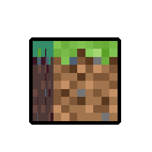

<div align="center">
  <h1>⚒️ Minecraft Developer & Software Engineer ⚒️</h1>
  
  <p>
    <a href="https://github.com/iiXXiXii"></a>
    <a href="https://discord.com"></a>
    <a href="https://t.me/iiXXiXii"></a>
  </p>
  
  <p>
    
    
  </p>
  
  
</div>

## 🚀 About Me


Hello, I'm **iiXXiXii** from Planet Earth. I'm a passionate Java developer with a deep love for Minecraft. My journey in coding has been centered around creating immersive experiences through PaperMC plugins, where I combine technical expertise with creative solutions.

I believe in the power of clean, efficient code that enhances gameplay while maintaining server performance. My work reflects a balance between functionality and innovation, always striving to push the boundaries of what's possible within the Minecraft ecosystem.

<details>
<summary><b>🌱 More About Me</b></summary>
<br>
  
- 🌍 Proudly calling Earth my home
- 🎮 Minecraft enthusiast and plugin architect
- 🧠 Constantly exploring new technologies and development approaches
- 💡 Passionate about creating elegant solutions to complex problems
  
</details>

<div align="center">
  
</div>

## 💻 Technical Expertise

<div align="center">
  <table>
    <tr>
      <td align="center">
        <br>
        <strong>Java</strong>
      </td>
      <td align="center">
        <br>
        <strong>Kotlin</strong>
      </td>
      <td align="center">
        <br>
        <strong>C++</strong>
      </td>
      <td align="center">
        <br>
        <strong>JavaScript</strong>
      </td>
      <td align="center">
        <br>
        <strong>TypeScript</strong>
      </td>
    </tr>
  </table>
</div>

<details open>
<summary><b>🖥️ Core Technologies</b></summary>
<div align="center">
  
  
  
  
  
  
  
  
  
  
  

</div>
</details>

<details>
<summary><b>⚙️ Frameworks & Libraries</b></summary>
<div align="center">
  
  
  
  
  
</div>
</details>

<div style="display: grid; grid-template-columns: 1fr 1fr; gap: 20px;">
  <div>
    <details>
    <summary><b>🧰 Development Tools</b></summary>
    <div align="center">
    


    
    </div>
  </details>

  <details>
    <summary><b>🗃️ Databases</b></summary>
    <div align="center">
    


    
    </div>
  </details>
</div>

<div>
  <details>
    <summary><b>☁️ Cloud & Infrastructure</b></summary>
    <div align="center">
    


    
    </div>
  </details>

  <details>
    <summary><b>🎨 Creative Tools</b></summary>
    <div align="center">
    


    
    </div>
  </details>
</div>

<details>
<summary><b>🖥️ Operating Systems & Environment</b></summary>
<div align="center">
  


</div>
</details>

<details>
<summary><b>🎮 Gaming & Minecraft Development</b></summary>
<div align="center">
  <table>
    <tr>
      <td align="center">
        <br>
        <strong>Minecraft</strong>
      </td>
      <td align="center">
        <br>
        <strong>PaperMC</strong>
      </td>
      <td align="center">
        <br>
        <strong>Spigot</strong>
      </td>
    </tr>
  </table>
  
  
  
  
  
</div>
</details>

<div align="center">
  
</div>

## 🏆 Featured Projects

<div align="center">
  <div class="project-grid" style="display: flex; flex-wrap: wrap; justify-content: center; gap: 20px;">
    <a href="https://github.com/iiXXiXii/EnchantedCrafting" target="_blank">
      
    </a>
    <a href="https://github.com/iiXXiXii/MinimalQuest" target="_blank">
      
    </a>
  </div>
  <div class="project-grid" style="display: flex; flex-wrap: wrap; justify-content: center; gap: 20px; margin-top: 10px;">
    <a href="https://github.com/iiXXiXii/ServerSakura" target="_blank">
      
    </a>
    <a href="https://github.com/iiXXiXii/ArchCraft" target="_blank">
      
    </a>
  </div>
</div>

<div class="project-details" style="margin-top: 20px;">
  <details>
    <summary><b>📁 Project Details</b></summary>
    <div class="project-cards" style="margin-top: 15px;">
      <table>
        <tr>
          <td>
            <h3>🧩 EnchantedCrafting</h3>
            <p>A revolutionary PaperMC plugin that introduces a unique crafting system with custom recipes, animations, and special effects, enhancing the Minecraft experience with beautiful visuals.</p>
            <p><strong>Technologies:</strong> Java, PaperMC API, Spigot API</p>
          </td>
          <td>
            <h3>📜 MinimalQuest</h3>
            <p>A clean, minimalist quest system for Minecraft servers that embraces simplicity while providing powerful quest-creation tools for server administrators.</p>
            <p><strong>Technologies:</strong> Java, PaperMC API, MySQL/MongoDB</p>
          </td>
        </tr>
        <tr>
          <td>
            <h3>⚙️ ServerSakura</h3>
            <p>A comprehensive server management plugin with advanced performance optimization techniques, ensuring smooth gameplay even with high player counts.</p>
            <p><strong>Technologies:</strong> Java, PaperMC API, Redis</p>
          </td>
          <td>
            <h3>🏞️ ArchCraft</h3>
            <p>A specialized Minecraft world generation plugin that creates stunning landscapes, architectural structures, and custom biomes with attention to detail.</p>
            <p><strong>Technologies:</strong> Java, PaperMC API, WorldEdit API</p>
          </td>
        </tr>
      </table>
    </div>
  </details>
</div>

<div align="center">
  
</div>

## 📊 GitHub Stats & Activity

<div align="center">
  <!-- GitHub Streak Stats -->
  <a href="https://github.com/iiXXiXii/">
    
  </a>
  <!-- GitHub Stats -->
  <a href="https://github.com/iiXXiXii/">
    
  </a>
  
  <!-- Top Languages -->
  <a href="https://github.com/iiXXiXii/">
    
  </a>
  <!-- GitHub Contribution Graph -->
  <a href="https://github.com/iiXXiXii/">
    
  </a>
  
  <!-- GitHub Trophies -->
  
  
  <!-- GitHub Snake Animation -->
  
</div>

<div align="center">
  
</div>

## 🔄 Automated Workflows

<div align="center">
  
</div>

<details>
<summary><b>⚡ GitHub Actions & Automations</b></summary>
<br>

```yaml
# Example CI/CD Workflow for PaperMC Plugins
name: Java CI with Gradle

on:
  push:
    branches: [main]
  pull_request:
    branches: [main]

jobs:
  build:
    runs-on: ubuntu-latest
    steps:
      - uses: actions/checkout@v3
      - name: Set up JDK 17
        uses: actions/setup-java@v3
        with:
          java-version: "17"
          distribution: "temurin"
      - name: Build with Gradle
        uses: gradle/gradle-build-action@v2
        with:
          arguments: build
      - name: Upload artifact
        uses: actions/upload-artifact@v3
        with:
          name: Plugin-JAR
          path: build/libs/*.jar
```

### Active Automations:

- 📊 README stats auto-update (daily)
- 🔍 Dependency vulnerability scanning
- 📦 Automatic Docker image builds
- 🧪 Automated testing for Java plugins
- 📢 Release notifications via webhook

</details>

<div align="center">
  
</div>

## 📫 Connect With Me

<div align="center">
  <a href="https://github.com/iiXXiXii">
    
  </a>
  <a href="https://discord.com">
    
  </a>
  <a href="https://t.me/iiXXiXii">
    
  </a>
  <a href="mailto:contact@iixxixii.dev">
    
  </a>
</div>


<div align="center">
  <p style="margin-top: -100px;">「Thank you for visiting my profile. May your code be as elegant as it is functional.」</p>
</div>
