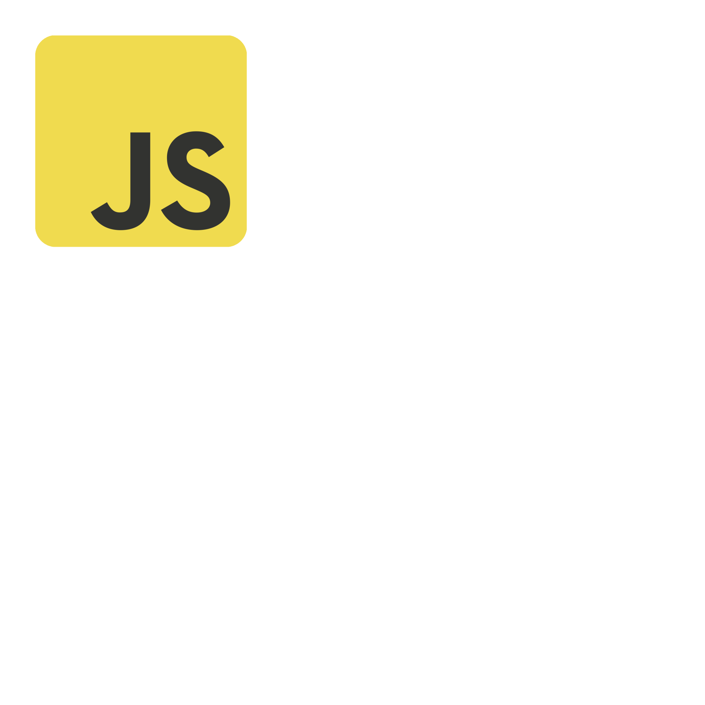
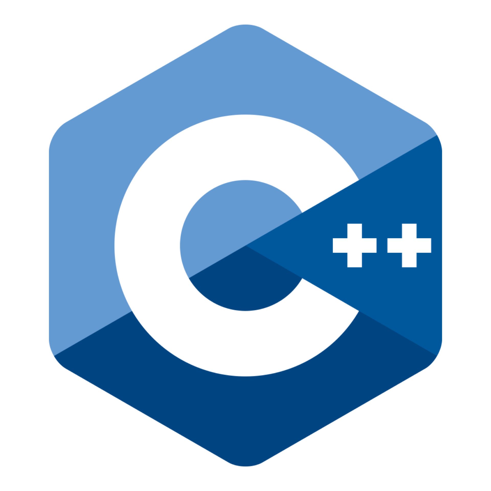
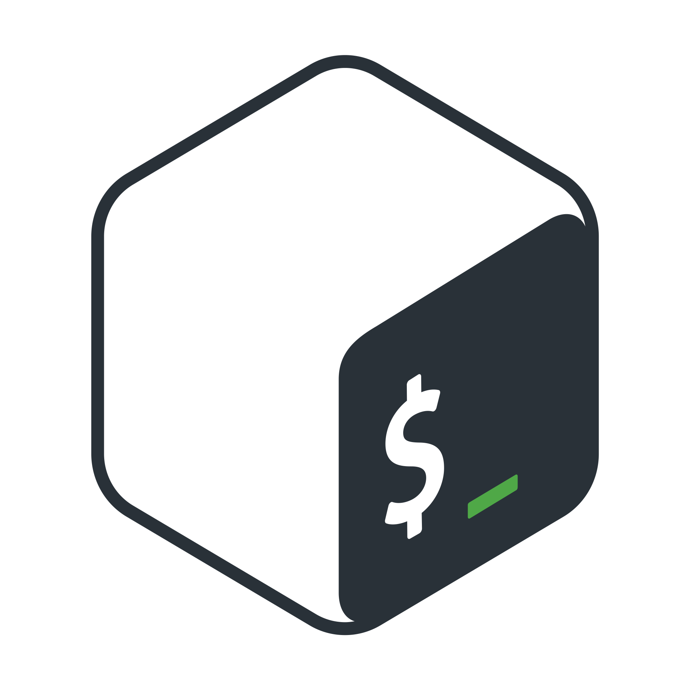
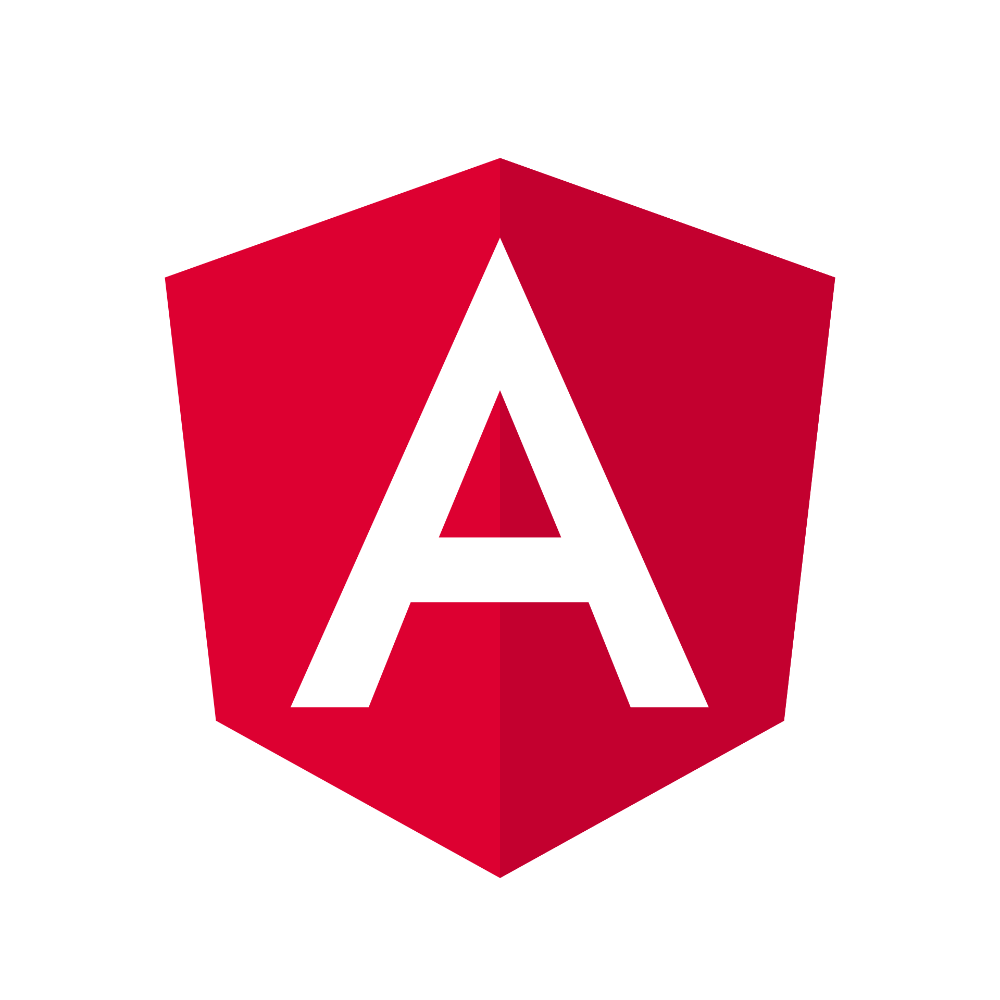
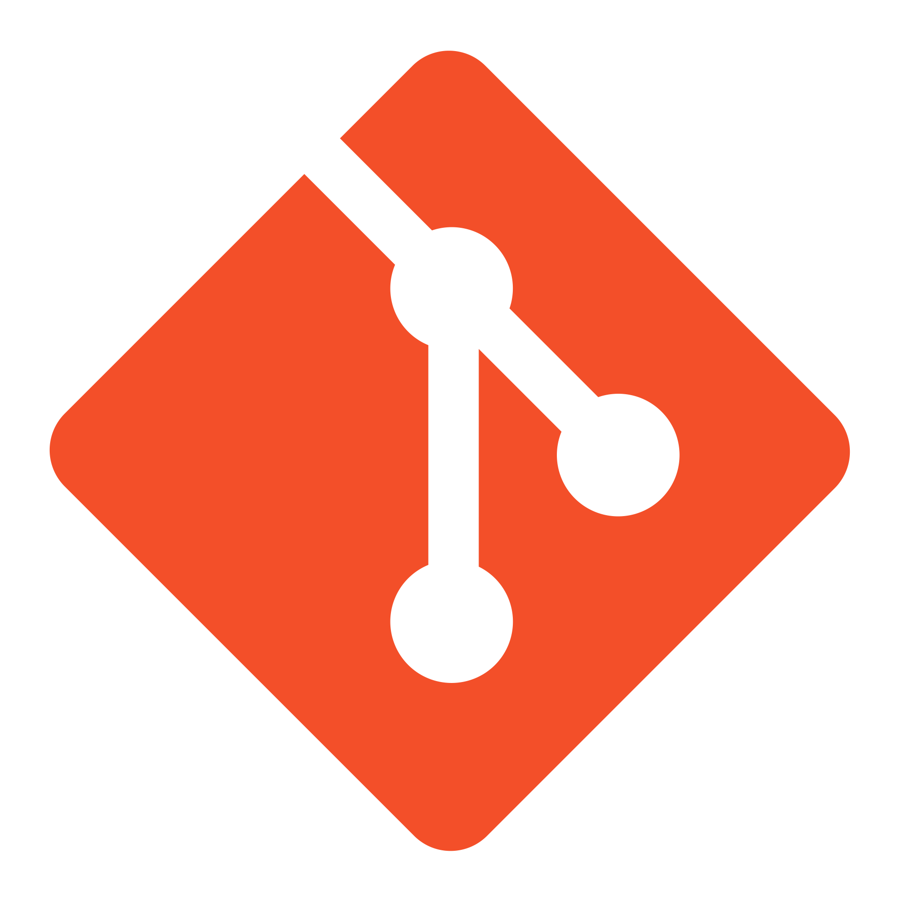
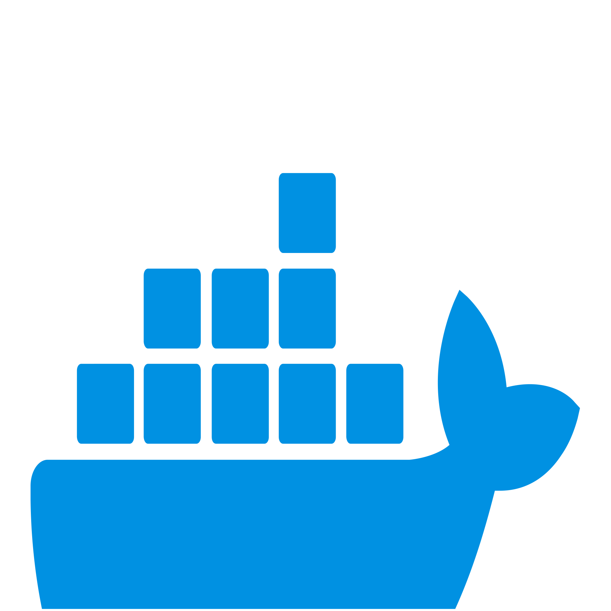
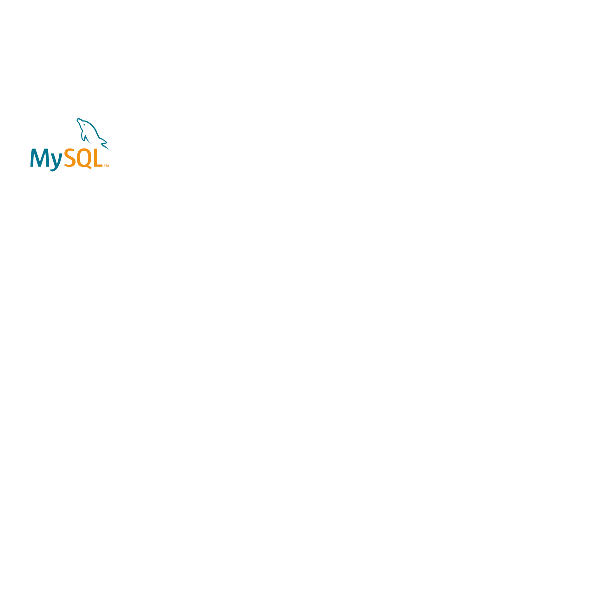
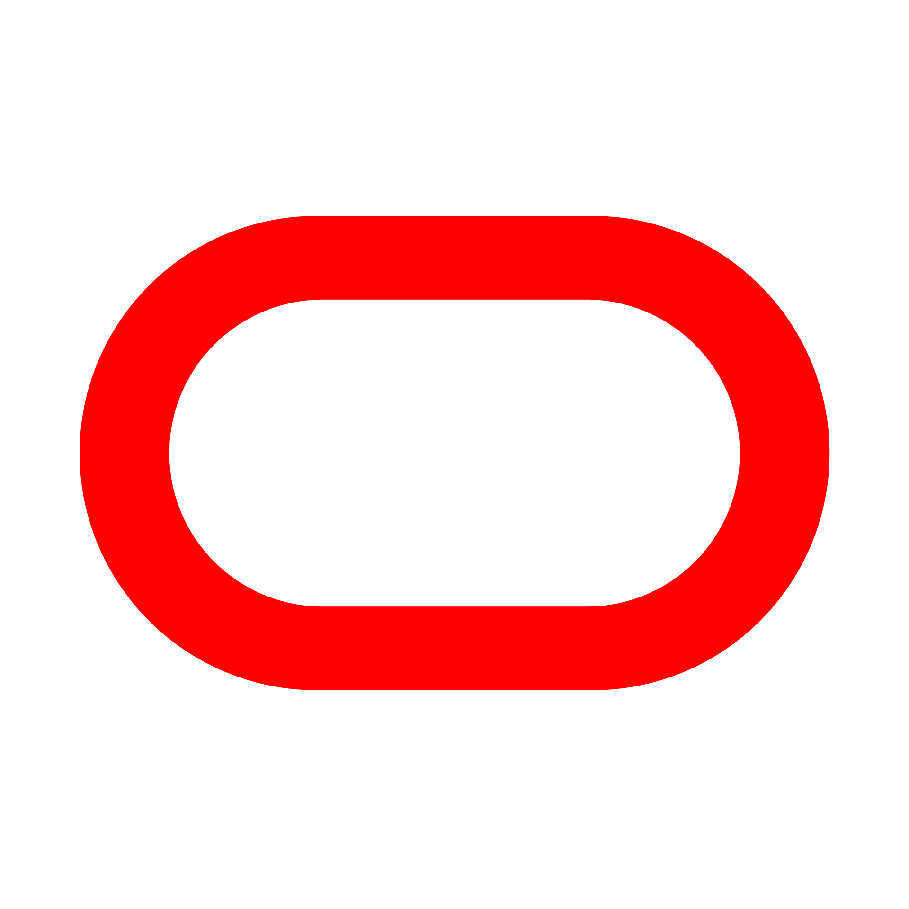
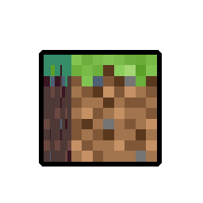

<div align="center">
  
</div>

<h1 align="center">こんにちは!  I'm iiXXiXii</h1>
<h3 align="center">Java & Minecraft Developer | Backend Engineer | Server Optimization Specialist</h3>

<div align="center">
  
  [](https://git.io/typing-svg)
  
</div>

<p align="center">
  <a href="https://github.com/iiXXiXii?tab=followers">
    
  </a>
  <a href="https://github.com/iiXXiXii">
    
  </a>
  <a href="https://discord.com">
    
  </a>
  <a href="https://www.reddit.com/user/iiXXiXii">
    
  </a>
  <a href="mailto:dev@iixxixii.com">
    
  </a>
</p>

<!-- LAST_UPDATED_BADGE:START -->
<p align="center">
  
</p>
<!-- LAST_UPDATED_BADGE:END -->

<!-- QUOTE_OF_THE_DAY:START -->
<div align="center">
  <table>
    <tr>
      <td align="center">
        
        <br/>
        <i>"Any fool can write code that a computer can understand. Good programmers write code that humans can understand."</i>
        <br/>
        <b>— Martin Fowler</b>
        <br/><br/>
        <sub>Quote refreshes daily. Last update: 00:00 UTC, April 18, 2025</sub>
      </td>
    </tr>
  </table>
</div>
<!-- QUOTE_OF_THE_DAY:END -->

## 👨‍💻 About Me


```yaml
name: iiXXiXii
pronouns: "he/him"
location: "Japan"
education: "Computer Science"
job: "Backend Developer & Minecraft Plugin Engineer"

interests:
  - High-performance Java applications
  - Server optimization
  - Clean code architecture
  - Cloud technologies
  - Game development
  
currently_learning:
  - "Advanced microservice architecture"
  - "Kubernetes orchestration"
  - "Performance profiling techniques"
```

私はクリエイティブなソリューションを提供するJava開発者です。I create high-performance Java applications and Minecraft plugins that deliver exceptional user experiences. I'm passionate about optimizing backend systems and crafting clean, efficient code.

- 🔧 **Specializes in**: Java backends, Minecraft server optimization, performance tuning
- 🚀 **Mission**: Creating elegant solutions that prioritize clean code and performance
- 🌍 **Philosophy**: "Performance isn't an add-on feature, it's the foundation"
- 🌱 **Learning**: Advanced cloud architecture, containerization strategies, JVM internals

## 🛠️ Tech Stack

<div align="center">
  <details open>
    <summary><b>💻 Core Languages</b></summary>
    <br/>
    <p>
      &nbsp;
      &nbsp;
      &nbsp;
      &nbsp;
      &nbsp;
      
    </p>
  </details>

  <details open>
    <summary><b>🧰 Development Tools</b></summary>
    <br/>
    <p>
      &nbsp;
      &nbsp;
      &nbsp;
      &nbsp;
      &nbsp;
      
    </p>
  </details>

  <details open>
    <summary><b>☁️ Infrastructure & Operations</b></summary>
    <br/>
    <p>
      &nbsp;
      &nbsp;
      &nbsp;
      &nbsp;
      &nbsp;
      &nbsp;
      
    </p>
  </details>
  
  <details>
    <summary><b>🗄️ Database Technologies</b></summary>
    <br/>
    <p>
      &nbsp;
      &nbsp;
      &nbsp;
      &nbsp;
      
    </p>
  </details>
  
  <details>
    <summary><b>🎮 Gaming & 3D</b></summary>
    <br/>
    <p>
      &nbsp;
      &nbsp;
      &nbsp;
      &nbsp;
      
    </p>
  </details>
  
  <details>
    <summary><b>🎨 Media & Design</b></summary>
    <br/>
    <p>
      &nbsp;
      &nbsp;
      
    </p>
  </details>
  
  <details>
    <summary><b>👨‍💻 IDE & Editors</b></summary>
    <br/>
    <p>
      &nbsp;
      
    </p>
  </details>
</div>

## 📊 GitHub Analytics

<div align="center">
  <a href="https://github.com/iiXXiXii">
    
    
  </a>
</div>

<div align="center">
  
  
</div>

## 🔭 Recent Activity

### 🐍 Contribution Graph

<div align="center">
  <picture>
    <source media="(prefers-color-scheme: dark)" srcset="https://raw.githubusercontent.com/iiXXiXii/iiXXiXii/output/github-contribution-grid-snake-dark.svg">
    <source media="(prefers-color-scheme: light)" srcset="https://raw.githubusercontent.com/iiXXiXii/iiXXiXii/output/github-contribution-grid-snake.svg">
    
  </picture>
</div>

<!-- GITHUB_ACTIVITY:START -->
<div align="center">
  <table>
    <tr>
      <td>🎉 Merged PR <a href="https://github.com/iiXXiXii/awesome-minecraft-plugins/pull/42">#42</a> in <code>iiXXiXii/awesome-minecraft-plugins</code></td>
    </tr>
    <tr>
      <td>💬 Commented on issue <a href="https://github.com/iiXXiXii/java-utilities/issues/37">#37</a> in <code>iiXXiXii/java-utilities</code></td>
    </tr>
    <tr>
      <td>⭐ Starred repository <a href="https://github.com/papermc/paper"><code>papermc/paper</code></a></td>
    </tr>
    <tr>
      <td>🔍 Reviewed PR <a href="https://github.com/iiXXiXii/server-optimization/pull/28">#28</a> in <code>iiXXiXii/server-optimization</code></td>
    </tr>
    <tr>
      <td>📝 Created issue <a href="https://github.com/iiXXiXii/minecraft-plugin-collection/issues/55">#55</a> in <code>iiXXiXii/minecraft-plugin-collection</code></td>
    </tr>
  </table>
</div>
<!-- GITHUB_ACTIVITY:END -->

## 🚀 Featured Projects

<div align="center">
  <table>
    <tr>
      <td align="center" width="33%">
        <br/>
        <h3>BetterServer Suite</h3>
        <p>Performance-focused plugin collection with 300+ monthly downloads, reducing server load by 40%</p>
        <a href="https://github.com/iiXXiXii/minecraft-plugin-collection">
          
        </a>
      </td>
      <td align="center" width="33%">
        <br/>
        <h3>ContainerizeMe</h3>
        <p>Containerization toolkit reducing deployment time by 65% and simplifying scaling for Java applications</p>
        <a href="https://github.com/iiXXiXii/server-optimization">
          
        </a>
      </td>
      <td align="center" width="33%">
        <br/>
        <h3>Java Performance Toolkit</h3>
        <p>Thread-safe utility library optimizing memory usage and processing speed for Java applications</p>
        <a href="https://github.com/iiXXiXii/java-utilities">
          
        </a>
      </td>
    </tr>
  </table>
</div>

<div align="center" style="margin-top: 30px;">
  <a href="https://github.com/iiXXiXii?tab=repositories&q=&type=&language=&sort=stargazers">
    
  </a>
</div>

## 🎯 Core Competencies

<div align="center">
  <table>
    <tr>
      <td align="center" width="25%">
        <b>🚀 Performance Optimization</b>
        <br/>
        <sub>Memory management, profiling, bottleneck identification, JVM tuning</sub>
      </td>
      <td align="center" width="25%">
        <b>⚙️ System Architecture</b>
        <br/>
        <sub>Microservices, event-driven design, scalable systems</sub>
      </td>
      <td align="center" width="25%">
        <b>🧠 Algorithm Design</b>
        <br/>
        <sub>Efficient data structures, time/space complexity optimization</sub>
      </td>
      <td align="center" width="25%">
        <b>🔄 CI/CD Automation</b>
        <br/>
        <sub>Pipeline optimization, automated testing, deployment automation</sub>
      </td>
    </tr>
  </table>
</div>

## ⚙️ Automated Profile Features

<div align="center">
  <table>
    <tr>
      <th align="center">🤖 Feature</th>
      <th align="center">📅 Update Frequency</th>
      <th align="center">🔄 Manual Trigger</th>
    </tr>
    <tr>
      <td align="center">
        
      </td>
      <td align="center">Daily (Midnight UTC)</td>
      <td align="center">
        <a href="https://github.com/iiXXiXii/iiXXiXii/actions/workflows/daily-quote.yml?query=event%3Aworkflow_dispatch">
          
        </a>
      </td>
    </tr>
    <tr>
      <td align="center">
        
      </td>
      <td align="center">Daily & On Commit</td>
      <td align="center">
        <a href="https://github.com/iiXXiXii/iiXXiXii/actions/workflows/last-update.yml">
          
        </a>
      </td>
    </tr>
    <tr>
      <td align="center">
        
      </td>
      <td align="center">Every 12 Hours</td>
      <td align="center">
        <a href="https://github.com/iiXXiXii/iiXXiXii/actions/workflows/github-activity.yml?query=event%3Aworkflow_dispatch">
          
        </a>
      </td>
    </tr>
    <tr>
      <td align="center">
        
      </td>
      <td align="center">Weekly (Sunday)</td>
      <td align="center">
        <a href="https://github.com/iiXXiXii/iiXXiXii/actions/workflows/snake.yml">
          
        </a>
      </td>
    </tr>
    <tr>
      <td align="center">
        
      </td>
      <td align="center">Weekly (Monday) & On Dependency Updates</td>
      <td align="center">
        <a href="https://github.com/iiXXiXii/iiXXiXii/actions/workflows/dependency-check.yml">
          
        </a>
      </td>
    </tr>
    <tr>
      <td align="center">
        
      </td>
      <td align="center">On Code Push & Pull Requests</td>
      <td align="center">
        <a href="https://github.com/iiXXiXii/iiXXiXii/actions/workflows/build-test.yml">
          
        </a>
      </td>
    </tr>
  </table>
</div>

## 📫 Connect With Me

<div align="center">
  <a href="https://discord.com/users/iixxixii">
    
  </a>
  &nbsp;&nbsp;
  <a href="https://github.com/iiXXiXii">
    
  </a>
  &nbsp;&nbsp;
  <a href="https://www.reddit.com/user/iiXXiXii">
    
  </a>
  &nbsp;&nbsp;
  <a href="mailto:dev@iixxixii.com">
    
  </a>
</div>

---

<div align="center">
  
  <br/>
  
  <br/><br/>
  <p>Thanks for visiting my profile! Feel free to explore my repositories and reach out for collaboration! 🚀</p>
  <p>プロフィールにお越しいただきありがとうございます！私のリポジトリをご覧いただき、ぜひご連絡ください！</p>
</div>
