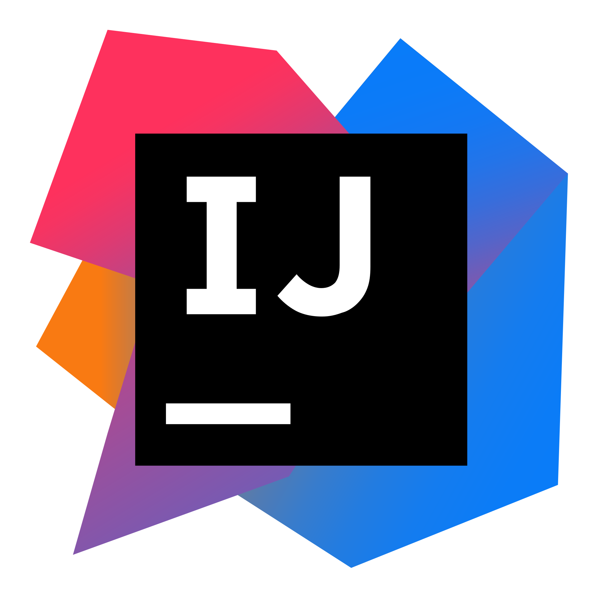

  

<h1 align="center">👋 こんにちは！ I'm iiXXiXii</h1>
<h3 align="center">A passionate Java developer crafting Minecraft plugins, websites & creative applications</h3>

  
  
  
  
  

<!-- LAST_UPDATED_BADGE:START -->

  

<!-- LAST_UPDATED_BADGE:END -->

<!-- QUOTE_OF_THE_DAY:START -->

  
  > **"It's not a bug – it's an undocumented feature."**
  >
  > — _Anonymous_

<!-- QUOTE_OF_THE_DAY:END -->

## 🌟 About Me

私は創造的なコーディングが大好きです！I'm an enthusiastic Java developer who enjoys exploring new technologies and building creative solutions. When I'm not coding, you can find me:

- 🔧 Building and optimizing Minecraft servers & plugins
- 🌐 Exploring web development technologies
- 📊 Working with databases and backend systems
- 🎮 Gaming and creating gaming-related applications

私の目標は、楽しく使いやすいアプリケーションを作ることです。I believe in crafting technology that is both powerful and accessible!

### 💡 Current Focus

- 🌱 Advanced cloud architecture and containerization techniques
- 🔭 High-performance Minecraft plugin development
- 👯 Open-source Java projects and collaborations
- 🤔 Application performance optimization
- ✨ Building tools that solve real-world problems

  
  

## 📊 GitHub Stats & Activity

  
  

### 🔭 Recent GitHub Activity

<!-- GITHUB_ACTIVITY:START -->

  <table>
    <tr>
      <td>🎉 Merged PR <a href="https://github.com/iiXXiXii/awesome-minecraft-plugins/pull/42">#42</a> in <code>iiXXiXii/awesome-minecraft-plugins</code></td>
    </tr>
    <tr>
      <td>💬 Commented on issue <a href="https://github.com/iiXXiXii/java-utilities/issues/37">#37</a> in <code>iiXXiXii/java-utilities</code></td>
    </tr>
    <tr>
      <td>⭐ Starred repository <a href="https://github.com/papermc/paper"><code>papermc/paper</code></a></td>
    </tr>
    <tr>
      <td>🔍 Reviewed PR <a href="https://github.com/iiXXiXii/server-optimization/pull/28">#28</a> in <code>iiXXiXii/server-optimization</code></td>
    </tr>
    <tr>
      <td>📝 Created issue <a href="https://github.com/iiXXiXii/minecraft-plugin-collection/issues/55">#55</a> in <code>iiXXiXii/minecraft-plugin-collection</code></td>
    </tr>
  </table>

<!-- GITHUB_ACTIVITY:END -->

  

### 🐍 Contribution Graph

  <picture>
    <source media="(prefers-color-scheme: dark)" srcset="https://raw.githubusercontent.com/iiXXiXii/iiXXiXii/output/github-contribution-grid-snake-dark.svg">
    <source media="(prefers-color-scheme: light)" srcset="https://raw.githubusercontent.com/iiXXiXii/iiXXiXii/output/github-contribution-grid-snake.svg">
    
  </picture>

  

## 🛠️ Technologies & Tools

  
<b>💻 Programming Languages</b>

  

    
    
    
    
    
    
  

  
<b>🧰 Frameworks & Development</b>

  

    
    
    
    
    
    
  

  
<b>☁️ Cloud & Infrastructure</b>

  

    
    
    
    
    
    
    
  

  
<b>🛠️ Development Environments</b>

  

    
    
  

  
<b>🗄️ Databases</b>

  

    
    
    
    
    
  

  
<b>🎨 Creative & Media</b>

  

    
    
    
    
  

  
<b>🎮 Gaming & Entertainment</b>

  

    
    
    
    
  

## 🚀 Featured Projects

  <table>
    <tr>
      <td align="center" width="33%">
        <a href="https://github.com/iiXXiXii/minecraft-plugin-collection">
           
          <b>Minecraft Plugin Collection</b>
        </a>
         
        Custom plugins enhancing Minecraft server experiences with performance optimizations and gameplay features
         
        
      </td>
      <td align="center" width="33%">
        <a href="https://github.com/iiXXiXii/server-optimization">
           
          <b>Server Performance Suite</b>
        </a>
         
        Tools, configurations and best practices for high-performance server deployment and optimization
         
        
      </td>
      <td align="center" width="33%">
        <a href="https://github.com/iiXXiXii/java-utilities">
           
          <b>Java Utility Libraries</b>
        </a>
         
        Comprehensive collection of reusable Java utility classes, functions, and performance enhancers
         
        
      </td>
    </tr>
  </table>

  

## ⚙️ Automated GitHub Profile

  
This profile README is automatically updated using GitHub Actions workflows!

<table>
  <tr>
    <th align="center"><b>🔄 Daily Updates</b></th>
    <th align="center"><b>💡 On-Demand Updates</b></th>
  </tr>
  <tr>
    <td valign="top">
      <ul>
        <li>
          <a href="https://github.com/iiXXiXii/iiXXiXii/actions/workflows/daily-quote.yml">
            📝 Daily Developer Quote
          </a>
           Updates the inspirational quote daily
        </li>
        <li>
          <a href="https://github.com/iiXXiXii/iiXXiXii/actions/workflows/last-update.yml">
            🕒 Last Updated Badge
          </a>
           Updates timestamp on profile README
        </li>
        <li>
          <a href="https://github.com/iiXXiXii/iiXXiXii/actions/workflows/github-activity.yml">
            🔍 GitHub Activity Feed
          </a>
           Shows recent activity on GitHub
        </li>
      </ul>
    </td>
    <td valign="top">
      <ul>
        <li>
          <a href="https://github.com/iiXXiXii/iiXXiXii/actions/workflows/snake.yml">
            🐍 Snake Animation
          </a>
           Regenerates contribution graph animation
        </li>
        <li>
          <a href="https://github.com/iiXXiXii/iiXXiXii/actions/workflows/daily-quote.yml?query=event%3Aworkflow_dispatch">
            🎲 Random Quote Generator
          </a>
           Manually update the quote
        </li>
        <li>
          <a href="https://github.com/iiXXiXii/iiXXiXii/actions/workflows/github-activity.yml?query=event%3Aworkflow_dispatch">
            📊 Activity Refresh
          </a>
           Manually update activity feed
        </li>
      </ul>
    </td>
  </tr>
</table>

## 📫 Let's Connect!

  
  &nbsp;&nbsp;
  
  &nbsp;&nbsp;
  
  &nbsp;&nbsp;
  

---

  
    
  
Thanks for visiting my profile! Feel free to reach out and connect! 😊

  
ご閲覧ありがとうございます！お気軽にご連絡ください！

